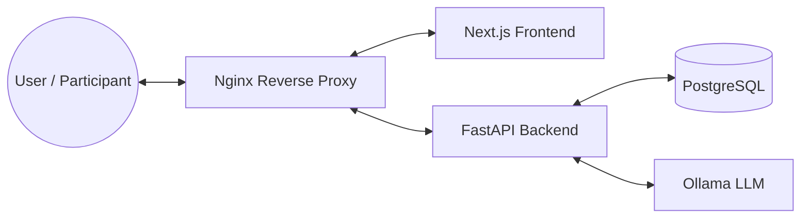

# EXCEED Prolific Orchestrator

A full-stack, containerized platform for code evaluation and survey collection to be launched on Prolific, orchestrated
with Docker Compose.

---

## 🧩 Stack Overview

- **Frontend**: [Next.js](https://nextjs.org/) (implemented within
  [exceed-prolific-frontend](https://github.com/alemoraru/exceed-prolific-frontend))
- **Backend**: [FastAPI](https://fastapi.tiangolo.com/) (implemented
  within [exceed-prolific-backend](https://github.com/alemoraru/exceed-prolific-backend))
- **Database:** [PostgreSQL](https://www.postgresql.org/)
- **LLM Service:** [Ollama](https://ollama.com/) (local LLM inference)
- **Reverse Proxy:** [Nginx](https://nginx.org/)

---

## 🏗️ Architecture



- **Port 80**: Only Nginx is exposed externally.
- **Internal Networking**: Backend, DB, and Ollama are only accessible within the Docker network.
- **API Routing**: Frontend calls `/api/...` -> Nginx proxies to backend.
- **Static Assets**: Nginx caches static files for performance.

---

## ⚡ Quickstart

1. **Clone the repository:**
   ```sh
   git clone https://github.com/alemoraru/exceed-prolific-orchestrator.git
   cd exceed-prolific-orchestrator
   ```
2. **Build and start all services:**
   ```sh
   docker compose up --build
   ```
3. **Open your browser:**
   [http://localhost](http://localhost)

> Note: Without any explicit environment variables, the backend will use default credentials (`admin`/`admin`)
> and the database will be named `prolific`. The Ollama service will use the default model `deepseek-coder:6.7b`.

---

## ⚙️ Environment Variables

| Service  | Variable                   | Value / Description                                                                 |
|----------|----------------------------|-------------------------------------------------------------------------------------|
| Frontend | `NEXT_PUBLIC_BACKEND_HOST` | *(empty)* — API calls resolve to `/api/...`                                         |
| Backend  | `FRONTEND_URL`             | `http://frontend:3000` — frontend URL for the Prolific webapp                       |
| Backend  | `DATABASE_URL`             | `postgresql://${POSTGRES_USER:-admin}:${POSTGRES_PASSWORD:-admin}@db:5432/prolific` |
| Backend  | `OLLAMA_URL`               | `http://ollama:11434`                                                               |
| Backend  | `OLLAMA_MODEL`             | Model to use for LLM inference (default: `deepseek-coder:6.7b`)                     |
| DB       | `POSTGRES_USER`            | Database username (default: `admin`)                                                |
| DB       | `POSTGRES_PASSWORD`        | Database password (default: `admin`)                                                |
| Ollama   | `OLLAMA_MODEL`             | Model to download and serve (required, see below)                                   |

---

## 🧪 Example Usage

### Running with Default Database and LLM Model

```sh
docker compose up --build
```

This will use the default Postgres credentials (`admin`/`admin`), database (`prolific`), and the default LLM model (
`llama3.1:8b`).

### Overriding Database Credentials and LLM Model

```sh
export POSTGRES_USER=myuser 
export POSTGRES_PASSWORD=mypass
export OLLAMA_MODEL=codellama:7b
docker compose up --build
```

### Allowed LLM Models

The following models are allowed for `OLLAMA_MODEL`:

- `llama3.2:3b`
- `llama3.1:8b`
- `codellama:7b`
- `codellama:13b`
- `mistral:7b`
- `codestral:22b`
- `deepseek-r1:14b`
- `qwen3:14b`
- `qwen2.5-coder:3b`
- `qwen2.5-coder:7b`
- `qwen2.5-coder:14b`
- `deepseek-coder:6.7b`

If you set `OLLAMA_MODEL` to a value not in this list, the Ollama container will exit with an error.
Note that the model you have selected will be downloaded automatically by the Ollama container on startup.
For that to work, there should be enough disk and memory available on the machine running Docker.

---

## 📝 Notes

- **Timeouts:** Nginx increases `/api` timeouts to 5 minutes for long-running backend endpoints.
- **Direct Access:** For development, backend and frontend containers are also available on their respective ports.
- **Static Caching:** Nginx caches static assets for 1 year by default.

---

## 🛠️ Prerequisites

- [Docker](https://www.docker.com/)
- [Docker Compose](https://docs.docker.com/compose/)

---

## 🤝 Contributing

This project was developed as part of the EXCEED MSc Thesis project at Technische Universiteit Delft. As such,
contributions of any sort will not be accepted. This repository is provided for replication and educational purposes
ONLY. Since it was used to orchestrate the deployment of our study on Prolific, it is NOT intended for further
development or contributions.

---

## 📄 License

This project is licensed under the MIT License. See the [LICENSE](LICENSE) file for details.
