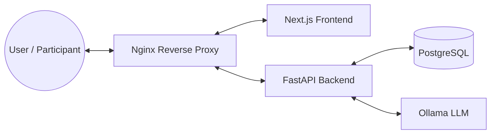

# EXCEED Prolific Orchestrator

A full-stack, containerized platform for code evaluation and survey collection to be launched on Prolific, orchestrated
with Docker Compose.

---

## 🧩 Stack Overview

- **Frontend**: [Next.js](https://nextjs.org/) (implemented within
  [exceed-prolific-frontend](https://github.com/alemoraru/exceed-prolific-frontend))
- **Backend**: [FastAPI](https://fastapi.tiangolo.com/) (implemented
  within [exceed-prolific-backend](https://github.com/alemoraru/exceed-prolific-backend))
- **Database:** [PostgreSQL](https://www.postgresql.org/)
- **LLM Service:** [Ollama](https://ollama.com/) (local LLM inference)
- **Reverse Proxy:** [Nginx](https://nginx.org/)

---

## 🏗️ Architecture



- **Port 80**: Only Nginx is exposed externally.
- **Internal Networking**: Backend, DB, and Ollama are only accessible within the Docker network.
- **API Routing**: Frontend calls `/api/...` -> Nginx proxies to backend.
- **Static Assets**: Nginx caches static files for performance.

---

## ⚡ Quickstart

1. **Clone the repository:**
   ```sh
   git clone https://github.com/alemoraru/exceed-prolific-orchestrator.git
   cd exceed-prolific-orchestrator
   ```
2. **Build and start all services:**
   ```sh
   docker compose up --build
   ```
3. **Open your browser:**
   [http://localhost](http://localhost)

---

## ⚙️ Environment Variables

| Service  | Variable                   | Value / Description                                |
|----------|----------------------------|----------------------------------------------------|
| Frontend | `NEXT_PUBLIC_BACKEND_HOST` | *(empty)* — API calls resolve to `/api/...`        |
| Backend  | `CORS_ORIGINS`             | `http://localhost` — allows frontend via nginx     |
| Backend  | `PROLIFIC_FRONTEND_URL`    | `http://frontend:3000` — frontend URL for Prolific |
| Backend  | `DATABASE_URL`             | `postgresql://admin:admin@db:5432/prolific`        |
| Backend  | `OLLAMA_URL`               | `http://ollama:11434`                              |

---

## 📝 Notes

- **CORS:** To allow other origins, update `CORS_ORIGINS` in the backend service in `docker-compose.yml`.
- **Timeouts:** Nginx increases `/api` timeouts to 5 minutes for long-running backend endpoints.
- **Direct Access:** For development, backend and frontend containers are also available on their respective ports.
- **Static Caching:** Nginx caches static assets for 1 year by default.

---

## 🛠️ Prerequisites

- [Docker](https://www.docker.com/)
- [Docker Compose](https://docs.docker.com/compose/)

---

## 🤝 Contributing

This project was developed as part of the EXCEED MSc Thesis project
at [Technische Universiteit Delft](https://www.tudelft.nl/en/). As such, contributions of any sort will not be accepted.
This repository is provided for replication and educational purposes ONLY. Since it was used to orchestrate the
deployment of our study on Prolific, it is NOT intended for further development or contributions.

---

## 📄 License

[MIT](LICENSE)
